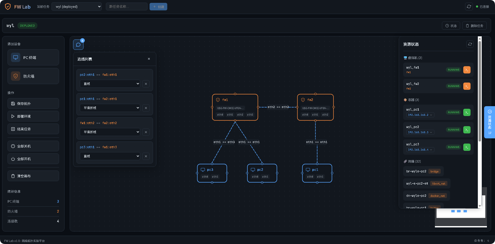
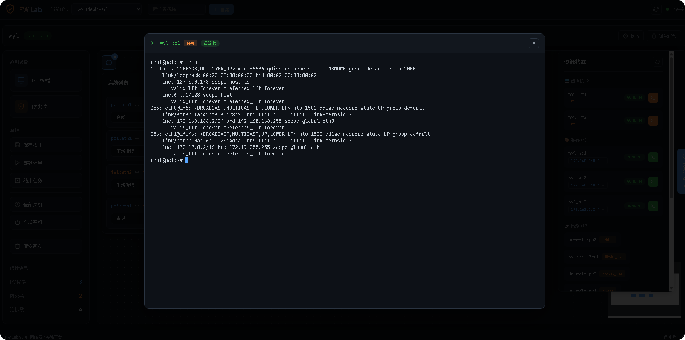

<p align="right">
  中文 | <a href="./README.md">English</a>
</p>

# VTTP - 虚拟化拓扑测试平台

一个用于 **部署与管理网络拓扑实验环境** 的综合平台，支持防火墙、虚拟机以及容器等多种资源类型。

**如果你还在为测试镜像而不停的搭建环境，又或者是为了验证POC方案而去安装各种机器或是接线**

**那么VTTP 将帮你解决如下问题：**

**1、直接一键虚拟化所有想要的环境**

**2、环境之间拖拽模拟实现网线连接**

**3、可以直接在web上进入shell**

**4、妈妈再也不用担心我在机房到处接线🌶**





---

## 🚀 功能特性

* **拓扑管理**：通过可视化界面设计并保存网络拓扑
* **多资源支持**：统一编排虚拟机、容器与网络桥接
* **防火墙集成**：支持多种防火墙镜像与配置方式
* **资源管理**：实时监控已部署资源的 CPU 与内存使用情况
* **交互式终端**：

  * Container WebShell（容器 Web 终端）
  * VM 串口控制台（虚拟机管理）
* **生命周期控制**：支持节点或任务级别的启动 / 停止 / 重启
* **IPAM**：自动化管理管理网段的 IP 地址分配

---

## 🏗️ 系统架构

```
fw-lab-v1/
├── backend/              # 后端服务（FastAPI）
│   ├── main.py           # API 接口入口
│   ├── orchestrator.py   # 资源部署与编排逻辑
│   ├── ipam.py           # IP 地址管理
│   ├── models.py         # 数据库模型
│   ├── db.py             # 数据库配置
│   ├── webshell.py       # 容器 Web 终端
│   └── vmshell.py        # 虚拟机串口控制台
└── frontend/             # 前端（Vue.js）
    ├── src/
    │   ├── App.vue
    │   ├── components/
    │   └── api.js
    └── index.html

```

---

## 📋 环境依赖

* Linux 主机（已在 Ubuntu 上测试）
* KVM / QEMU + libvirt
* Python 3.10+
* Node.js 16+（前端开发）

### 系统要求

* **管理网桥**：`br-mgmt`（`192.168.168.0/24`）
* **权限要求**：当前用户需具备 Docker 与 libvirt 访问权限
* **硬件资源**：需具备足够的 CPU / 内存以支持虚拟机运行

---

## 🔧 安装部署

### 1️⃣ 配置DHCP服务器
sudo apt install -y dnsmasq

#### 编辑配置文件
sudo vim /etc/dnsmasq.d/mgmt.conf

#### 写入以下内容
interface=br-mgmt
bind-interfaces
dhcp-range=192.168.168.50,192.168.168.200,12h
dhcp-option=3,192.168.168.1
dhcp-option=6,192.168.168.1

#### 启动
sudo systemctl restart dnsmasq

#### 验证dhcp是否正常
sudo dnsmasq --test

#### 出现以下内容则OK
dnsmasq: syntax check OK.

---

### 2️⃣ 配置管理网络

#### 创建一个libvirt直连网络

```bash
sudo vim /tmp/br-mgmt.xml
# 写入
<network>
  <name>br-mgmt</name>
  <forward mode="bridge"/>
  <bridge name="br-mgmt"/>
</network>
# 加载
sudo virsh net-define /tmp/br-mgmt.xml
sudo virsh net-start br-mgmt
sudo virsh net-autostart br-mgmt
```

关键网络参数（位于 `ipam.py`）：

* **网络地址**：`192.168.168.0/24`
* **网关**：`192.168.168.1`
* **DHCP 范围**：`192.168.168.50-200`
* **静态地址范围**：`192.168.168.201-250`

---

### 3️⃣ 启动服务

#### 请确保镜像位于/img 目录下

```bash
sudo bash start_all.sh
```

启动后可访问：

* **后端 API**：[http://localhost:8000](http://localhost:8000)
* **前端界面**：[http://localhost:5173](http://localhost:5173)

---

### 4️⃣ 验证服务状态

```bash
curl http://localhost:8000/health
curl http://localhost:8000/images
```

---

## 🔧 配置说明

### IPAM（`ipam.py`）

```python
MGMT_BRIDGE = "br-mgmt"
MGMT_NETWORK = "192.168.168.0/24"
MGMT_GATEWAY = "192.168.168.1"
MGMT_DHCP_START = "192.168.168.50"
MGMT_DHCP_END = "192.168.168.200"
STATIC_IP_START = 201
STATIC_IP_END = 250
```

---

## 🐛 常见问题排查

* **虚拟机串口无法连接**：确认 VM 串口配置及运行状态
* **容器 Shell 异常**：确认容器运行状态及 shell 类型
* **网络异常**：检查 `br-mgmt` 网桥及 IP 分配情况

---

## 🤝 参与贡献

欢迎提交 Issue 与 Pull Request，共同完善项目。

---

> ⚠️ 本项目为实验/测试用途工具，未进行生产级安全加固，请谨慎用于生产环境。
